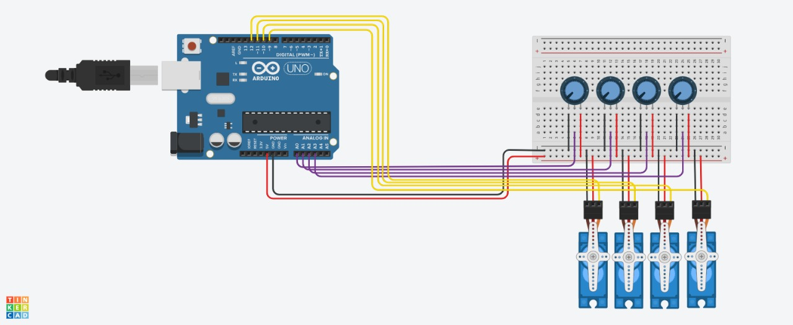
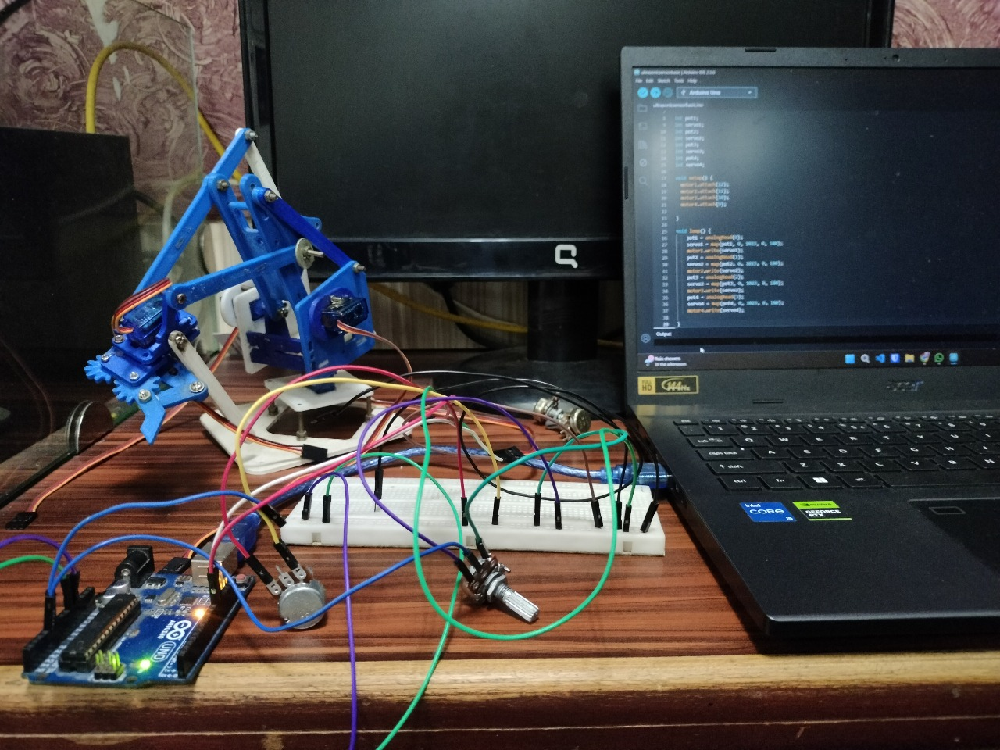

# 🤖 Robot Arm Control using Arduino

## 🧠 Introduction

This project demonstrates how to control a 4-servo robot arm using potentiometers and an Arduino Uno. Each potentiometer controls the angle of a corresponding servo motor, allowing smooth and precise joint movement. This is ideal for learning the basics of servo control, analog input handling, and building a simple robotic arm interface.

---

## 🔧 Components Used

- 1 × Arduino Uno
- 4 × Servo Motors (SG90 or similar)
- 4 × 10kΩ Potentiometers
- 1 × Breadboard
- Jumper Wires
- USB Cable (for Arduino power & programming)

---

## 🔌 Circuit Diagram

---

## 💻 Code

The Arduino code reads analog values from the potentiometers and maps them to servo angles between 0° and 180°.

📄 [robot_arm_control.ino](./robot_arm_control.ino)

---

## 🎬 Demo

You can add a video or GIF demo of the project in action here.

---

## 📌 How It Works

- Each potentiometer is connected to an analog pin (A0 to A3).
- The servo motors are connected to digital PWM pins (9 to 12).
- The analog value (0–1023) is mapped to an angle (0–180).
- Servos respond in real time as potentiometer positions change.

---
